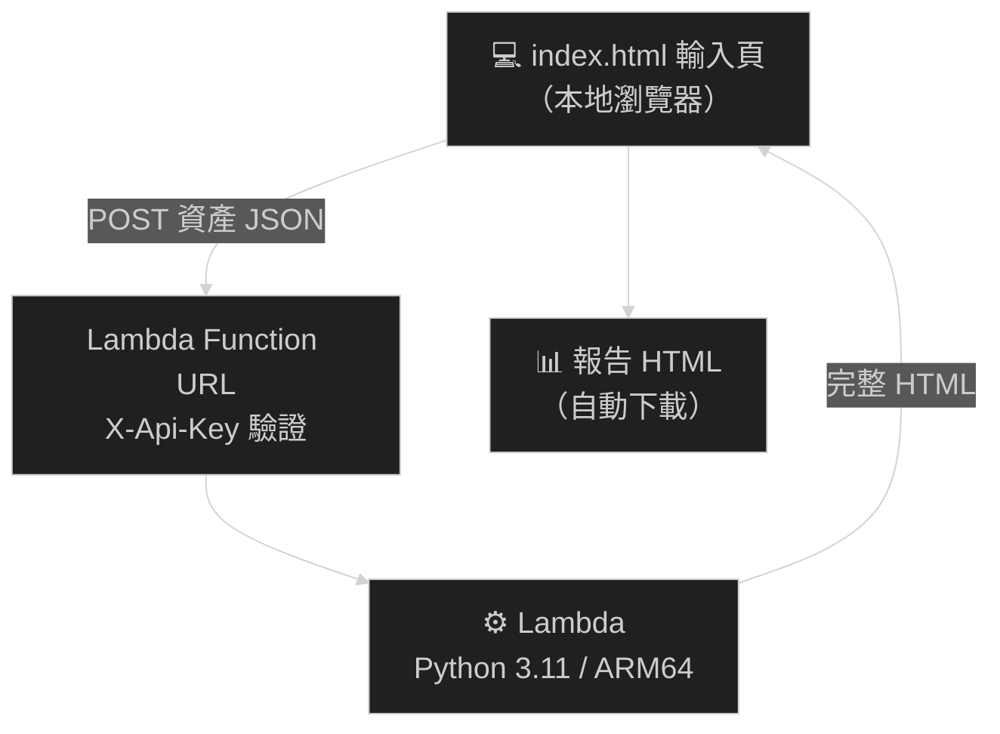
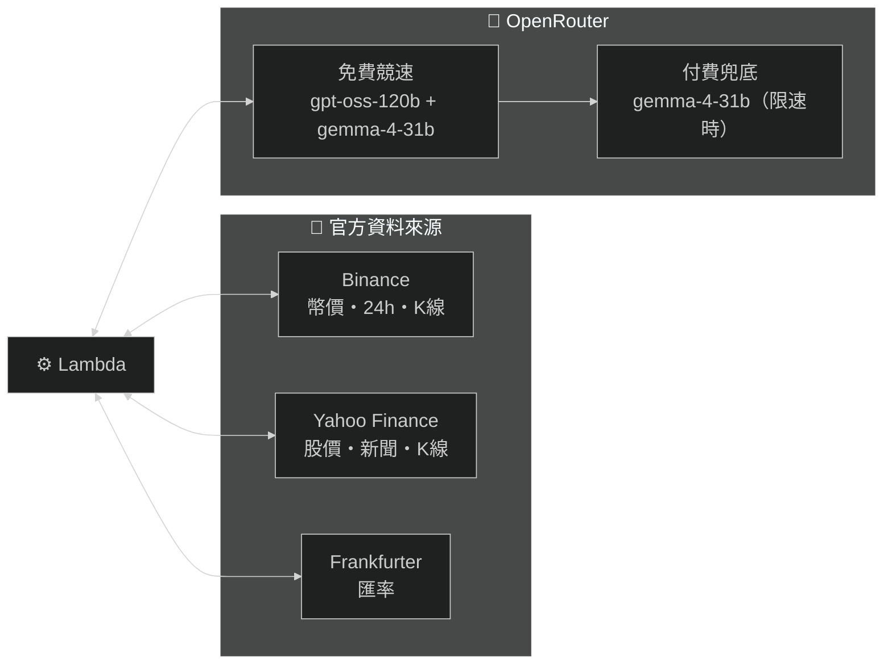
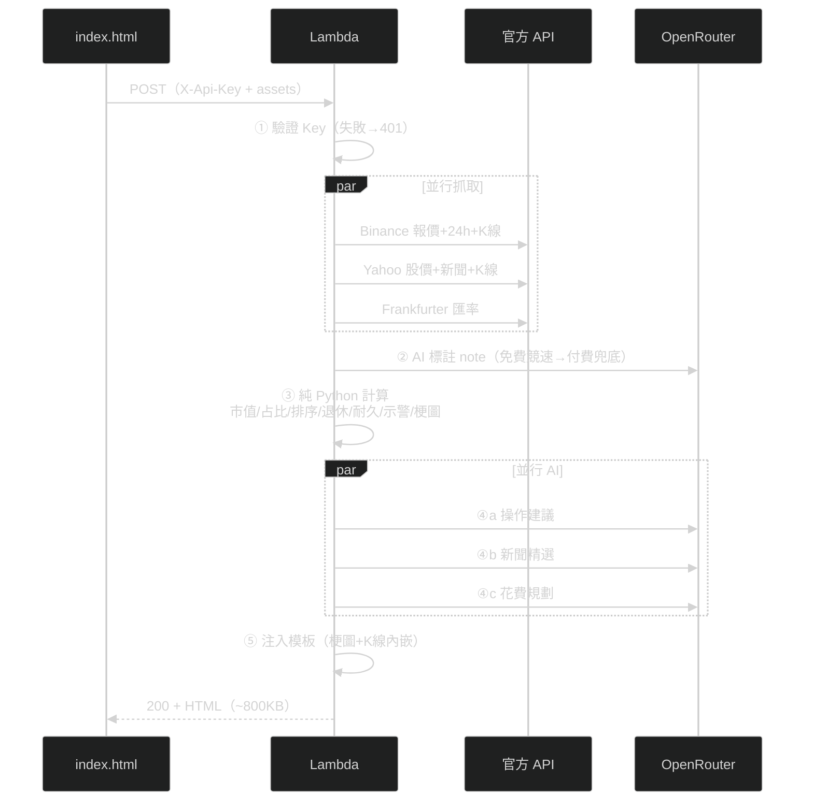

# Asset Report Bot — 無伺服器資產報告產生器

填入持倉 → 一鍵產出含即時報價、日線 K 圖、配置圖表、退休試算、風險示警與梗圖的 HTML 報告。
全無伺服器（AWS Lambda），閒置零成本。AI 採 **OpenRouter 免費模型競速 + 付費兜底**——
每份報告平常 **$0**（免費模型搶贏），僅免費全限速時才用付費模型兜底（每份約 NT$0.03）。

> 📊 **範例報告**：[線上預覽](https://htmlpreview.github.io/?https://github.com/burma2005/asset-report-bot/blob/main/docs/sample_report.html)
> ｜[下載 docs/sample_report.html](docs/sample_report.html)（範例數據，非真實持倉）

---

## 系統架構





---

## 如何觸發 Lambda

1. 瀏覽器開啟 `index.html`（本地檔案，無需伺服器）
2. 填入資產（加密貨幣／美股／台股／日股／美債／現金／其他資產七個分頁）、每月生活費、月收入
3. 點「📊 產生報告」→ 前端發出：

```
POST https://<function-url>.lambda-url.ap-northeast-1.on.aws/
Headers:
  Content-Type: application/json
  X-Api-Key: <共享密鑰>          ← 驗證機制
Body:
  {
    "assets": { "BTC": {"api":"binance","amount":0.5}, ... },
    "retirement_goal_monthly_twd": 25000,
    "monthly_income_twd": 0
  }
```

4. 約 1~2 分鐘後 Lambda 回傳完整 HTML，瀏覽器自動觸發下載（免費模型競速，速度視限速狀況浮動）

## 驗證機制

| 層級 | 機制 |
|------|------|
| 請求驗證 | 自訂 `X-Api-Key` 標頭，Lambda 第一步比對環境變數 `API_KEY`，不符回 401（不執行任何抓價/AI 呼叫，不產生費用） |
| 金鑰存放 | 部署時經 CloudFormation `NoEcho` 參數注入；本地端寫在 index.local.html（檔案不離開使用者電腦） |
| CORS | 由 Lambda Function URL 服務層統一處理（程式內不得重複加標頭，否則瀏覽器拒收） |
| AI 金鑰 | OpenRouter 金鑰經 `NoEcho` 參數 → 環境變數注入；Lambda 不需特殊 IAM（AI 改由 OpenRouter HTTPS 外呼） |

## Lambda 工作流



### 確定性 vs AI 的分工原則

| 計算 | 執行者 | 原因 |
|------|--------|------|
| 報價/匯率/K線抓取、市值與占比計算 | 純 Python | 數字不容 AI 幻覺 |
| 排序、類別彙總、退休進度、耐久試算、異常示警 | 純 Python | 同上 |
| note 標註（活期鎖定、殖利率等） | OpenRouter AI | 純文字標籤 |
| 操作建議 | OpenRouter AI | 諮詢性質內容 |
| 花費規劃、新聞精選 | OpenRouter AI | 諮詢性質內容 |
| 梗圖選擇 | 純 Python 規則 | 依訊號/進度確定性對應 |

## 調用的模型（OpenRouter）

每個 AI 呼叫採「**免費競速 → 付費兜底**」策略，由環境變數控制、免改碼可調：

| 階段 | 模型 | 機制 | 費用 |
|------|------|------|------|
| 競速（免費） | `openai/gpt-oss-120b:free` + `google/gemma-4-31b-it:free` | 同時發請求，誰先成功用誰 | **$0** |
| 兜底（付費） | `google/gemma-4-31b-it` | 免費全限速/逾時才呼叫，保證有結果 | ~$0.028/份 |

- 模型鏈由 `OPENROUTER_RACE_MODELS`（競速）與 `OPENROUTER_MODELS`（兜底）兩個環境變數控制
- OpenRouter 金鑰只進 `samconfig.toml`（雲端）或 `env.json`（本地），兩者皆 gitignore
- Lambda **無需 Anthropic / AWS Bedrock 權限**，AI 全經 OpenRouter HTTPS 外呼

> 所有數字（市值/占比/退休/耐久試算）由純 Python 計算，**不信任 AI 輸出的數字**；AI 僅負責質化文字（建議/新聞/花費評語/note）。

## 報告內容

1. **總覽**：總資產 TWD、產生時間（台北時區）
2. **子類別 KPI 卡**：鏈上現金／鏈下現金／加密部位／台股／日股／美股／債券／其他（依實際持有產生）
3. **資產配置比例圖**：深色卡片＋編號圖例（持有數量 × 原幣報價｜來源｜TWD 市值），占比由高至低
4. **四大部位圖**：現金／加密／股票／債券
5. **波動資產日線 K 圖**：近 90 日蠟燭圖（Binance/Yahoo 官方 K 線數據）
6. **風險示警**：穩定幣脫鉤（±0.5%/±3%）、24h 暴跌（加密 -5%/-10%、股票 -4%/-7%）、查無報價提醒
6. **持倉相關新聞**：Yahoo 官方新聞 API → AI 精選 1~3 則（可點擊原文）
7. **操作建議**：加碼/減碼/不動/觀察/再平衡 + 理由（納入月收入與退休狀態）
8. **資產明細表**：數量、原幣報價、來源標籤、TWD 市值、占比條
9. **退休試算**：4% 法則 + 目標進度條（所需資產 = 月生活費 × 300）
10. **花費規劃**：vs 台灣官方基準（最低生活費/平均消費/薪資中位數）+ 支出分配建議
11. **資產耐久試算**：首年提領 = 月花費×12，逐年通膨 +2%，三情境（3%/5%/7% 報酬）可撐年數 + 逐年明細表
12. **梗圖**：依市場情緒/配置健康/退休進度/建議動作，嵌入對應段落（base64 內嵌，離線可看）

## 定價試算

> 以東京區（ap-northeast-1）2026 年牌價估算，實際以帳單為準。

### 每次產生報告的成本拆解

| 項目 | 用量 | 單價 | 小計（USD） |
|------|------|------|------------|
| Lambda 運算 | ARM64 512MB × ~30s | $0.0000133/GB-s | ~$0.0002 |
| Lambda 請求 + Function URL | 1 次 | 近乎免費 | ~$0 |
| AI（免費競速搶贏時） | 4 次免費模型呼叫 | $0 | **$0** |
| AI（免費全限速 → 付費兜底） | 4 次 gemma-4-31b 付費 | $0.12 / $0.35 per MTok | ~$0.0009 |
| 回傳流量 | ~0.8 MB | $0.114/GB | ~$0 |
| **每次合計** | | | **~$0（平常）～ NT$0.03（兜底）** |

### 與原 AWS Bedrock 方案對比

| 方案 | 每份成本 | 備註 |
|------|---------|------|
| **OpenRouter 免費競速 + 付費兜底（現行）** | **$0 ～ NT$0.03** | 平常零成本，免費全限速才付費兜底 |
| 原 Bedrock Claude Haiku 4.5 | ~NT$0.31 | 按 token 計費，每份都收 |

> 免費模型每日 1000 次額度（每份 4 呼叫 ≈ 250 份/天）；超額或限速時自動掉到付費兜底，
> 不影響出報告。OpenRouter 帳上 $10 額度，純走付費兜底也可跑 **約 1 萬份**。

## 部署

詳見 [DEPLOYMENT.md](DEPLOYMENT.md)（**Agent 部署 SOP**：寫給 AI Agent 執行，人類只需四個介入點）。摘要：

```powershell
# 前置：aws login（瀏覽器授權）+ OpenRouter 金鑰（https://openrouter.ai/keys）
sam build
sam deploy   # 輸出 ReportEndpointUrl → 寫入 index.local.html 的 LAMBDA_ENDPOINT
```

## 專案結構

```
asset-report-bot/
├── index.html                    # 本地輸入頁範本（端點/金鑰為佔位符）
├── index.local.html              # 個人實際使用版（真實端點+金鑰，已 gitignore）
├── template.yaml                 # AWS SAM（Lambda + Function URL）
├── samconfig.toml.example        # 部署設定範本（複製為 samconfig.toml 後填金鑰）
├── env.json                      # 本地測試環境變數（含 OpenRouter 金鑰，已 gitignore）
├── DEPLOYMENT.md                 # Agent 部署 SOP
└── src/generate_report/          # Lambda 程式（sam build 打包整個目錄）
    ├── app.py                    # 入口：API Key 驗證 → 工作流 → 回傳 HTML
    ├── price_fetcher.py          # 並行抓價/匯率/新聞（純 Python；台股 .TW→.TWO 自動補救）
    ├── openrouter_client.py      # OpenRouter 呼叫：免費競速 + 付費兜底
    ├── claude_agent.py           # AI 質化文字 + 確定性計算 + 梗圖引擎
    ├── report_template.html      # 報告 HTML 模板（單一真相來源）
    └── memes/                    # 23 張情境梗圖（base64 內嵌報告）
```

## 聲明

### 梗圖版權聲明

`src/generate_report/memes/` 內之圖片擷取自動畫《BanG Dream! It's MyGO!!!!!》《Ave Mujica》，
著作權屬 © Bushiroad / BanG Dream! Project 及其相關權利人所有。

- 本專案為**個人非營利**性質，圖片僅作粉絲二創（meme）用途，無任何商業使用
- 本聲明不代表取得官方授權；若權利方提出要求，將**立即移除**相關圖片
- Fork 本專案者請自行評估使用風險，或將 `memes/` 替換為自有圖片
  （檔名對照 `claude_agent.py` 的 `MEME_LIBRARY` 即可無痛替換）

### 投資免責聲明

本工具產出之報告（含操作建議、退休試算、花費規劃）僅供個人參考，
由 AI 與公式自動生成，**不構成任何投資建議**。投資有風險，決策請自行判斷並承擔。
