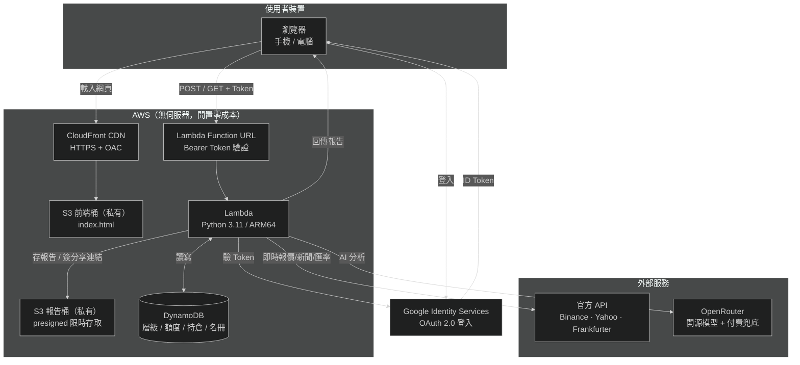
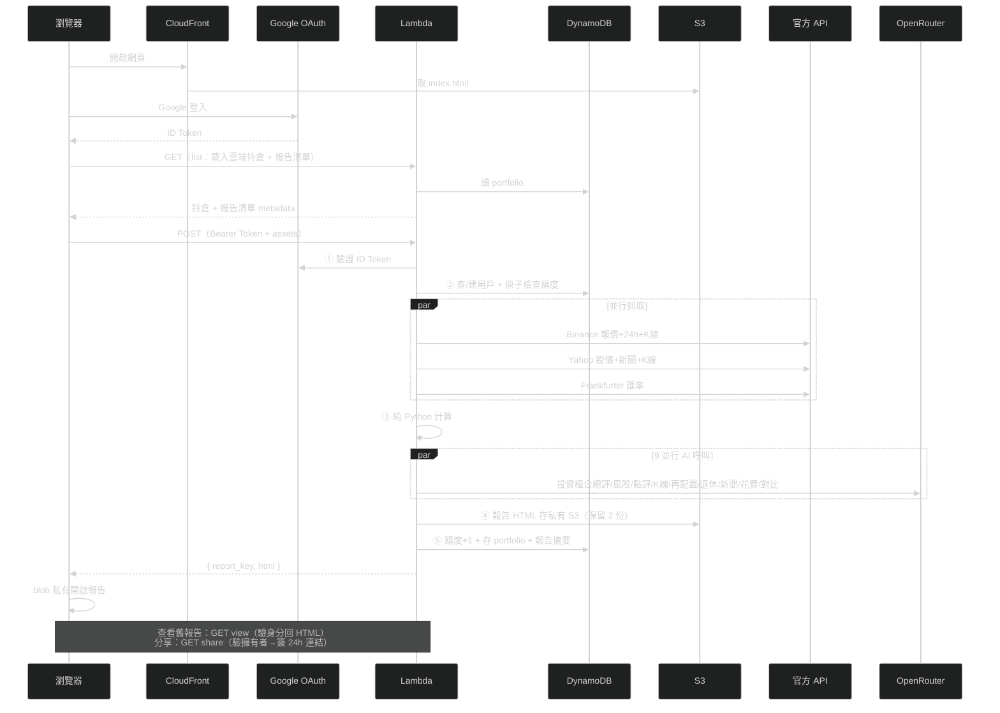

# Asset Report Bot — 無伺服器資產報告產生器

填入持倉 → 一鍵產出含即時報價、日線 K 圖、AI 深度分析、配置圖表、退休試算、風險示警與梗圖的 HTML 報告。
全無伺服器（AWS Lambda + DynamoDB + S3 + CloudFront），閒置零成本。

## 線上試用

**https://d3gds1i1v7w1x0.cloudfront.net**

任何人都可以用 Google 帳號登入試用。源碼完全公開，沒有後門、不會偷資料。

| 層級 | 每月額度 | AI 模型 | 如何取得 |
|------|---------|---------|---------|
| **general（免費）** | 12 次/月 | 開源模型 | Google 帳號登入即自動建立 |
| **invited** | 60 次/月 | 開源 + 付費兜底 | 與作者聯絡（僅開放認識的朋友） |
| **admin** | 無限 | 全模型 | 自行部署時設定 |

> 📊 **先看範例**：[線上預覽範例報告](https://htmlpreview.github.io/?https://github.com/burma2005/asset-report-bot/blob/main/docs/sample_report.html)（虛構持倉，非真實數據）
> 　🚀 **再決定試用**：[線上試用](https://d3gds1i1v7w1x0.cloudfront.net) 用自己的資產產一份（免費 12 次/月）

---

## 系統架構



---

## 功能特色

- **跨裝置同步**：持倉資料綁定 Google 帳號，換裝置登入自動載入
- **私有報告**：報告存私有 S3，預設只有本人（經身分驗證）能讀，無公開連結
- **主動分享**：報告內可選擇產生 24 小時公開分享連結（風險確認 + 60 秒冷卻）
- **報告對比**：保留最近 2 份報告，AI 自動對比上次與本次的資產變化並給出建議
- **手機友善**：輸入頁與報告均針對手機優化；偵測 App 內建瀏覽器並引導改用 Chrome（Google 登入限制）
- **首次登入聲明**：告知使用者資料保存用途與安全性
- **完全公開源碼**：無混淆、無後門，任何人可審查或自行部署

## 報告內容

1. **AI 與上次報告對比**：總資產變化、配置偏移、趨勢判讀、行動建議
2. **AI 投資組合總評**：配置健康度、集中風險、區域分散性
3. **配置分析**：資產配置圓餅圖 + 子類別 + 四大部位圖
4. **波動資產日線 K 圖**：近 90 日蠟燭圖 + AI 技術分析
5. **AI 風險評估**：資產集中、區域集中、幣別曝險、尾部風險
6. **風險示警**：穩定幣脫鉤、24h 暴跌、查無報價
7. **持倉相關新聞**：AI 精選 1~3 則
8. **AI 資產再配置建議**：積極型/穩健型/保守型 目標配置
9. **AI 逐筆資產點評**：每項重要持倉 1-2 句分析
10. **資產明細表**：數量、原幣報價、來源、TWD 市值、占比條
11. **退休試算**：4% 法則 + 目標進度條 + AI 退休敘事分析
12. **花費規劃**：vs 台灣官方基準 + 支出分配建議
13. **資產耐久試算**：三情境逐年明細表
14. **梗圖**：依市場情緒/配置健康/退休進度嵌入對應段落

## 資料隱私

- 持倉資料與報告僅與您的 **Google 帳號**綁定；報告存私有 S3，**預設只有本人經身分驗證能讀**，無公開連結
- 要分享時須**本人主動產生**限時（24h）公開連結，並先確認風險（含 60 秒冷卻防濫用）
- 傳輸全程 **HTTPS 加密**
- 每帳戶僅保留**最近 2 份報告**，舊報告自動刪除
- **不會分享、出售或用於任何商業用途**
- 源碼完全公開，可自行審查：沒有隱藏的資料收集、沒有追蹤碼、沒有第三方分析

## 用戶層級

| 層級 | 每月額度 | 付費兜底 | 如何取得 |
|------|---------|---------|---------|
| **admin** | 無限 | ✅ | 自行部署時設定 `AdminEmailParam` |
| **invited** | 60/月 | ✅ | 與作者聯絡 |
| **general** | 12/月 | ❌ 開源模型限定 | 任何 Google 帳號首次登入自動建立 |

- general 層級模型限流時，AI 區塊顯示提示，數字報告不受影響
- 每次產報告自動存持倉到 DynamoDB，跨裝置同步

## Lambda 工作流



### 確定性 vs AI 的分工原則

| 計算 | 執行者 | 原因 |
|------|--------|------|
| 報價/匯率/K線、市值與占比、退休試算、耐久模擬 | 純 Python | 數字不容 AI 幻覺 |
| 異常示警（脫鉤/暴跌）、梗圖選擇 | 純 Python 規則 | 確定性邏輯 |
| 投資組合總評、風險評估、資產點評、報告對比 | AI | 質化分析 |
| K 線技術分析（趨勢/支撐/壓力/操作建議） | AI | 依日線數據研判 |
| 資產再配置建議（積極/穩健/保守） | AI | 依風險偏好建議 |
| 退休敘事分析、新聞精選、花費規劃 | AI | 諮詢性質 |

> AI 分析區塊加有風險警語：「AI 分析僅供參考，不構成投資建議」。模型限流時顯示提示卡，不影響數字報告。

## 調用的模型（OpenRouter）

| 階段 | 模型 | 機制 | 費用 |
|------|------|------|------|
| 免費 | `openrouter/free` | OpenRouter 自動路由至當下可用的免費模型（自癒，免手動追換下架的 slug）| **$0** |
| 兜底（付費） | `google/gemma-4-31b-it` | 免費限流／逾時才呼叫（invited/admin 限定） | ~$0.03/份 |

> **為何不做多模型競速**：免費模型常被 OpenRouter 下架或輪換，寫死多支 slug 會不斷失效需維護。改為只保留自動路由的 `openrouter/free` 由 OpenRouter 挑當下可用的免費模型，**以穩定性與免維護為優先，略微犧牲速度**（少了「最快者勝」的加速）。等久一點可接受。

- general 層級 `allow_paid=False`，只走免費模型；模型全限流時 AI 區塊空白但數字正常
- admin/invited 預設仍走免費模型，僅在免費失敗（限流/逾時）時才落到付費兜底
- 9 個 AI 呼叫並行執行；因無競速加速，總延遲較長（視免費 provider 負載而定）
- 免費模型常被 OpenRouter 下架或限流；用 [`scripts/or_models.py`](scripts/or_models.py) 可隨時健檢與熱抽換（免重新部署），詳見 [DEPLOYMENT.md](DEPLOYMENT.md)

## 資安設計

| 面向 | 措施 |
|------|------|
| **身分驗證** | 後端驗 Google ID Token（驗 audience + email_verified），無有效權杖一律 401 |
| **報告存取** | 報告私有；查看須驗證本人（`view` 比對 email 雜湊前綴防 IDOR），分享須擁有者主動簽發限時連結 |
| **XSS** | 後端注入資料時跳脫 `< > &` 防 `</script>` 跳脫破框；前端所有寫入 `innerHTML` 的使用者/AI 文字皆經 `esc()` |
| **最小權限 IAM** | Lambda 僅授予 DynamoDB `GetItem/PutItem/UpdateItem`（無 Scan，防拖庫）+ 單一報告桶 S3 權限 |
| **額度/防濫用** | 額度與分享冷卻皆用 DynamoDB 條件更新**原子**判斷，併發無法繞過 |
| **輸入校驗** | 資產數值擋 NaN/Inf/離譜量級（允許負值如負債）；資產筆數上限 60 |
| **成本封頂** | 帳號 Lambda 並行上限天然封頂爆炸半徑（取代 WAF 的成本保護）；OpenRouter 以開源模型為主、付費僅 invited/admin 兜底 |
| **機密管理** | 金鑰走環境變數 + `NoEcho`，git 歷史零金鑰；前端 git 版維持 `__PLACEHOLDER__`，真實值僅部署時注入 |

> 關於 WAF：AWS WAF 無法直接掛 Lambda Function URL，且月費對個人專案不符成本。改以 Lambda 並行上限封頂成本 + 帳單警報達成 $0 的等效保護。

## 部署（自行部署）

詳見 [DEPLOYMENT.md](DEPLOYMENT.md)。摘要：

```powershell
# 前置：Google Cloud Console 建 OAuth Client ID + aws login + OpenRouter 金鑰
sam build
sam deploy   # 需填 GoogleClientIdParam / AdminEmailParam / OpenRouterKeyParam
# 部署後取 CloudFront 域名，到 Google Console 加 Authorized JavaScript origins
# 注入 index.html 並上傳 S3
```

## 專案結構

```
asset-report-bot/
├── index.html                    # 輸入頁範本（__PLACEHOLDER__ 部署時注入）
├── template.yaml                 # AWS SAM（Lambda + DynamoDB + 前端/報告兩個私有 S3 + CloudFront + OAC）
├── samconfig.toml.example        # 部署設定範本
├── DEPLOYMENT.md                 # 部署 SOP
├── docs/sample_report.html       # 範例報告（虛構持倉）
├── dist/                         # 注入後的上傳產物（gitignore）
└── src/generate_report/
    ├── app.py                    # 入口：JWT 驗簽 → 層級/額度 → S3 報告私有存取（view/share）
    ├── price_fetcher.py          # 並行抓價/匯率/新聞（純 Python）
    ├── openrouter_client.py      # OpenRouter：免費自動路由 + 付費兜底
    ├── claude_agent.py           # 9 項 AI 分析 + 報告對比 + 確定性計算 + 梗圖引擎
    ├── report_template.html      # 報告 HTML 模板（手機版 responsive + 下載/分享按鈕）
    ├── requirements.txt          # httpx, google-auth, requests
    └── memes/                    # 23 張情境梗圖（base64 內嵌報告）
```

## 未來功能（階段 4）

- **排程觸發**：EventBridge 定時產報告（每日/每週），不用手動登入
- **SES 寄信**：報告自動寄到信箱
- **歷史趨勢圖**：多期報告的總資產走勢圖
- **持倉手動同步按鈕**：不產報告也能儲存持倉到雲端
- **多語言**：英文版報告

## 聲明

### 梗圖版權聲明

`src/generate_report/memes/` 內之圖片擷取自動畫《BanG Dream! It's MyGO!!!!!》《Ave Mujica》，
著作權屬 © Bushiroad / BanG Dream! Project 及其相關權利人所有。

- 本專案為**個人非營利**性質，圖片僅作粉絲二創（meme）用途，無任何商業使用
- 本聲明不代表取得官方授權；若權利方提出要求，將**立即移除**相關圖片
- Fork 本專案者請自行評估使用風險，或將 `memes/` 替換為自有圖片

### 投資免責聲明

本工具產出之報告（含 AI 分析、操作建議、再配置建議、技術分析、退休試算、花費規劃）僅供個人參考，
由 AI 與公式自動生成，**不構成任何投資建議**。投資有風險，決策請自行判斷並承擔。
