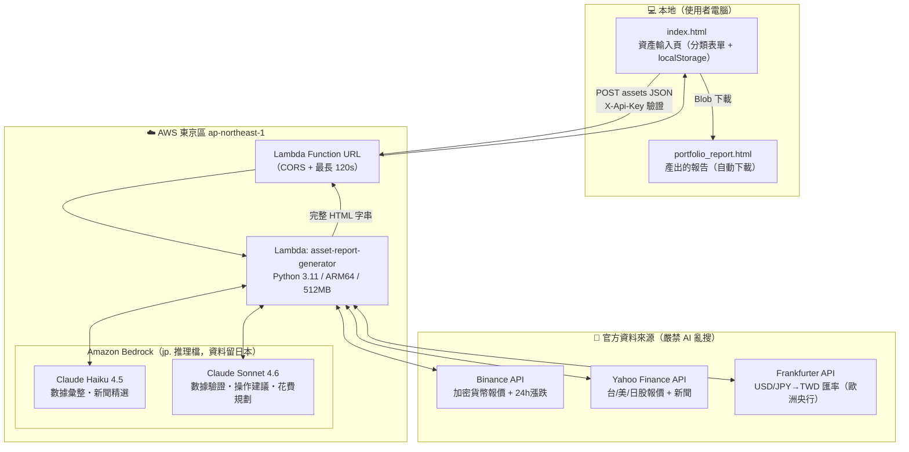
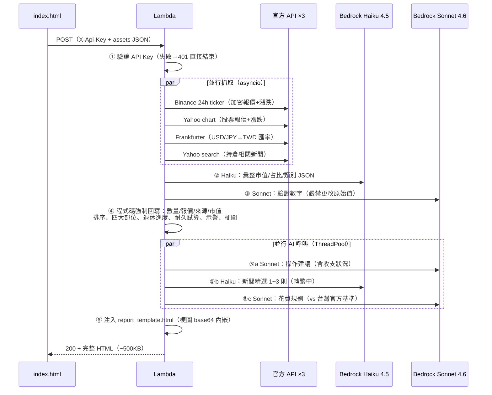

# Asset Report Bot — 無伺服器資產報告產生器

填入持倉 → 一鍵產出含即時報價、配置圖表、退休試算、風險示警與梗圖的 HTML 報告。
全無伺服器（AWS Lambda），閒置零成本，每次產報告約 **NT$ 2~3**（詳見下方定價試算）。

---

## 系統架構



---

## 如何觸發 Lambda

1. 瀏覽器開啟 `index.html`（本地檔案，無需伺服器）
2. 填入資產（加密貨幣／美股／台股／日股／美債／現金六個分頁）、每月生活費、月收入
3. 點「📊 產生報告」→ 前端發出：

```
POST https://<function-url>.lambda-url.ap-northeast-1.on.aws/
Headers:
  Content-Type: application/json
  X-Api-Key: <共享密鑰>          ← 驗證機制
Body:
  {
    "assets": { "BTC": {"api":"binance","amount":0.5}, ... },
    "retirement_goal_monthly_twd": 25000,
    "monthly_income_twd": 0
  }
```

4. 30~60 秒後 Lambda 回傳完整 HTML，瀏覽器自動觸發下載

## 驗證機制

| 層級 | 機制 |
|------|------|
| 請求驗證 | 自訂 `X-Api-Key` 標頭，Lambda 第一步比對環境變數 `API_KEY`，不符回 401（不執行任何抓價/AI 呼叫，不產生費用） |
| 金鑰存放 | 部署時經 CloudFormation `NoEcho` 參數注入；本地端寫在 index.html（檔案不離開使用者電腦） |
| CORS | 由 Lambda Function URL 服務層統一處理（程式內不得重複加標頭，否則瀏覽器拒收） |
| AWS 授權 | Lambda IAM Role 僅授權 `bedrock:InvokeModel`，最小權限 |

## Lambda 工作流



### 確定性 vs AI 的分工原則

| 計算 | 執行者 | 原因 |
|------|--------|------|
| 報價抓取、匯率換算、市值計算 | 純 Python | 數字不容 AI 幻覺 |
| 排序、退休進度、耐久試算（通膨提領模擬）、異常示警 | 純 Python | 同上 |
| 數量/報價/來源欄位 | Python 強制回寫 | AI 驗證後仍以 API 原值覆蓋 |
| 占比驗證、note 標註 | Sonnet（限制只修 pct） | 容錯補全 |
| 操作建議、花費規劃文字、新聞精選 | Sonnet / Haiku | 諮詢性質內容 |
| 梗圖選擇 | 純 Python 規則 | 依訊號/進度確定性對應 |

## 調用的模型

| 模型 | Bedrock Model ID | 用途 | 每次費用 |
|------|-----------------|------|---------|
| Claude Haiku 4.5 | `jp.anthropic.claude-haiku-4-5-20251001-v1:0` | 數據彙整、新聞精選 | ~$0.002 |
| Claude Sonnet 4.6 | `jp.anthropic.claude-sonnet-4-6` | 數據驗證、操作建議、花費規劃 | ~$0.025 |

> `jp.` 前綴 = 日本境內推理檔（資料不出境）。Lambda 以 IAM Role 授權，**無需 Anthropic API Key**。

## 報告內容

1. **總覽**：總資產 TWD、產生時間（台北時區）
2. **七子類別 KPI 卡**：鏈上現金／鏈下現金／加密部位／台股／日股／美股／債券
3. **資產配置比例圖**：深色卡片＋編號圖例（持有數量 × 原幣報價｜來源｜TWD 市值），占比由高至低
4. **四大部位圖**：現金／加密／股票／債券
5. **風險示警**：穩定幣脫鉤（±0.5%/±3%）、24h 暴跌（加密 -5%/-10%、股票 -4%/-7%）
6. **持倉相關新聞**：Yahoo 官方新聞 API → Haiku 精選 1~3 則（可點擊原文）
7. **操作建議**：加碼/減碼/不動/觀察/再平衡 + 理由（納入月收入與退休狀態）
8. **資產明細表**：數量、原幣報價、來源標籤、TWD 市值、占比條
9. **退休試算**：4% 法則 + 目標進度條（所需資產 = 月生活費 × 300）
10. **花費規劃**：vs 台灣官方基準（最低生活費/平均消費/薪資中位數）+ 支出分配建議
11. **資產耐久試算**：首年提領 = 月花費×12，逐年通膨 +2%，三情境（3%/5%/7% 報酬）可撐年數 + 逐年明細表
12. **梗圖**：依市場情緒/配置健康/退休進度/建議動作，嵌入對應段落（base64 內嵌，離線可看）

## AWS 定價試算

> 以東京區（ap-northeast-1）2026 年牌價估算，實際以 AWS 帳單為準。

### 每次產生報告的成本拆解

| 項目 | 用量 | 單價 | 小計（USD） |
|------|------|------|------------|
| Lambda 運算 | ARM64 512MB × ~30s = 15 GB-s | $0.0000133/GB-s | $0.0002 |
| Lambda 請求 | 1 次 | $0.20/百萬次 | ~$0 |
| Function URL | — | 免費 | $0 |
| Bedrock Haiku 4.5 ×2（彙整+新聞）| ~3K in / 1.5K out tokens | $1 / $5 per MTok | ~$0.011 |
| Bedrock Sonnet 4.6 ×3（驗證+建議+規劃）| ~6K in / 3K out tokens | $3 / $15 per MTok | ~$0.063 |
| 回傳流量 | ~0.5 MB | $0.114/GB | ~$0 |
| **每次合計** | | | **~$0.074（≈ NT$ 2.4）** |

### 月費情境

| 使用頻率 | 月報告數 | Bedrock | Lambda 等 | 月費（USD） | 月費（TWD） |
|---------|---------|---------|-----------|------------|------------|
| 每週 1 次 | 4 | $0.30 | ~$0 | **$0.30** | ~NT$ 10 |
| 每日 1 次 | 30 | $2.22 | $0.01 | **$2.23** | ~NT$ 72 |
| 每日 3 次 | 90 | $6.66 | $0.02 | **$6.68** | ~NT$ 215 |

### 與常駐方案對比

| 方案 | 月費 | 備註 |
|------|------|------|
| **本專案（Serverless）** | **$0.3 ~ $7** | 閒置零成本，用多少付多少 |
| EC2 t4g.small 常駐 + n8n | ~$12 + AI 費用 | 24/7 計費，閒置也燒錢 |
| n8n Cloud + 外部 LLM API | $20 起 | 執行次數另有上限 |

> 降費技巧：把 Sonnet 任務（建議/花費規劃）換成 Haiku 可再省 ~80% Bedrock 費用，
> 代價是文字品質略降——改 `template.yaml` 的 `BEDROCK_SONNET_MODEL` 環境變數即可。

## 部署

詳見 [DEPLOYMENT.md](DEPLOYMENT.md)（**Agent 部署 SOP**：寫給 AI Agent 執行，人類只需四個介入點）。摘要：

```powershell
# 前置：aws login（瀏覽器授權）+ Bedrock Model Access 啟用兩個 Claude 模型
sam build
sam deploy   # 輸出 ReportEndpointUrl → 寫入 index.html 的 LAMBDA_ENDPOINT
```

## 專案結構

```
asset-report-bot/
├── index.html                    # 本地輸入頁範本（端點/金鑰為佔位符）
├── index.local.html              # 個人實際使用版（真實端點+金鑰，已 gitignore）
├── template.yaml                 # AWS SAM（Lambda + Function URL + IAM）
├── samconfig.toml.example        # 部署設定範本（複製為 samconfig.toml 後填金鑰）
├── DEPLOYMENT.md                 # Agent 部署 SOP
└── src/generate_report/          # Lambda 程式（sam build 打包整個目錄）
    ├── app.py                    # 入口：API Key 驗證 → 工作流 → 回傳 HTML
    ├── price_fetcher.py          # 並行抓價/匯率/新聞（純 Python）
    ├── claude_agent.py           # Bedrock 雙模型 + 確定性計算 + 梗圖引擎
    ├── report_template.html      # 報告 HTML 模板（單一真相來源）
    └── memes/                    # 23 張情境梗圖（base64 內嵌報告）
```
