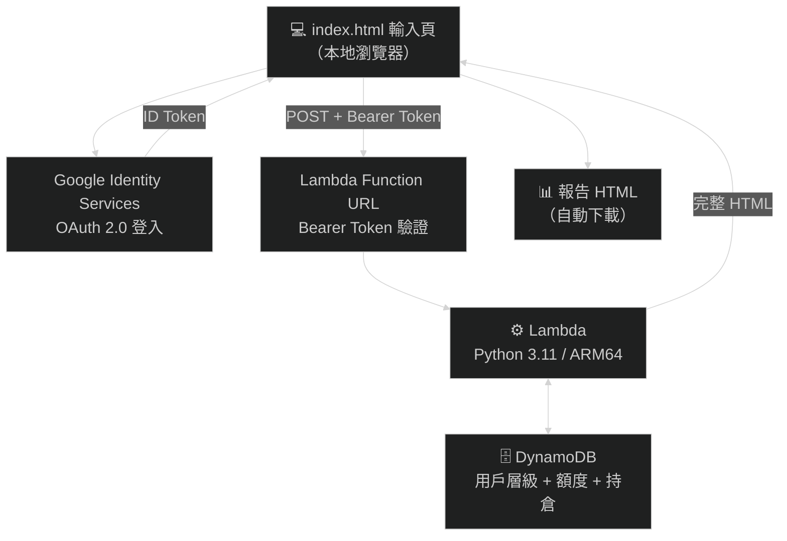
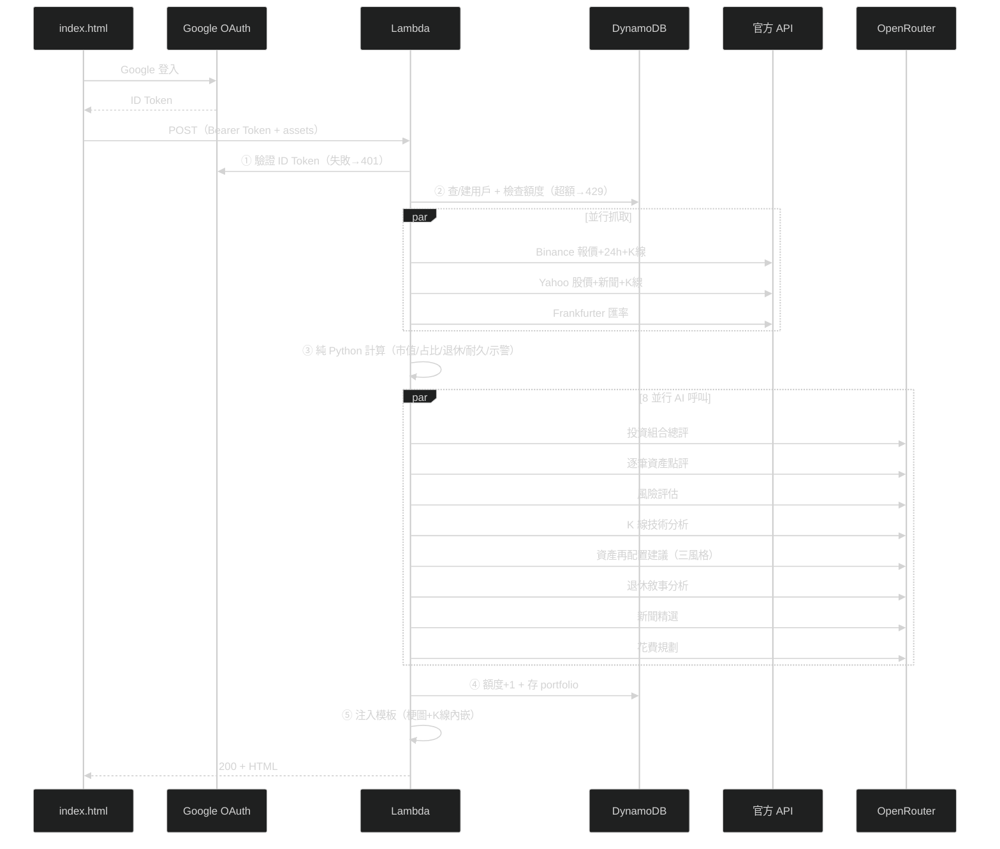

# Asset Report Bot — 無伺服器資產報告產生器

填入持倉 → 一鍵產出含即時報價、日線 K 圖、AI 深度分析、配置圖表、退休試算、風險示警與梗圖的 HTML 報告。
全無伺服器（AWS Lambda + DynamoDB），閒置零成本。

- **驗證**：Google 帳號登入（OAuth 2.0 ID Token）
- **用戶分級**：admin（無限）/ invited（30/月）/ general（4/月，免費模型限定）
- **AI**：OpenRouter 免費模型競速 + 付費兜底（admin/invited）

> 📊 **範例報告**：[線上預覽](https://htmlpreview.github.io/?https://github.com/burma2005/asset-report-bot/blob/main/docs/sample_report.html)
> ｜[下載 docs/sample_report.html](docs/sample_report.html)（範例數據，非真實持倉）

---

## 系統架構




---

## 用戶層級（Google 登入 + DynamoDB）

| 層級 | 每月額度 | 付費兜底 | 如何取得 |
|------|---------|---------|---------|
| **admin** | 無限 | ✅ | `ADMIN_EMAIL` 環境變數 |
| **invited** | 30/月 | ✅ | DynamoDB 預先 put-item |
| **general** | 4/月 | ❌ 免費限定 | 任何 Google 帳號首次登入自動建立 |

- admin 走環境變數判斷，不需 DynamoDB 紀錄
- general 免費模型全限流時，AI 區塊顯示「免費模型額度限制」提示，數字仍正常
- 每次產報告自動存 portfolio 到 DynamoDB（為排程寄信埋鉤子）

## 如何觸發 Lambda

1. 開 `http://localhost:8000/index.local.html`（需 `python -m http.server 8000`，GIS 不支援 `file://`）
2. Google 帳號登入
3. 填入資產（加密貨幣／美股／台股／日股／美債／現金／其他 七個分頁）、每月生活費、月收入
4. 點「📊 產生報告」→ 進度條顯示 13 步驟（約 2 分鐘）→ 自動下載 HTML 報告

```
POST https://<function-url>.lambda-url.ap-northeast-1.on.aws/
Headers:
  Content-Type: application/json
  Authorization: Bearer <Google ID Token>
```

## Lambda 工作流



### 確定性 vs AI 的分工原則

| 計算 | 執行者 | 原因 |
|------|--------|------|
| 報價/匯率/K線、市值與占比、退休試算、耐久模擬 | 純 Python | 數字不容 AI 幻覺 |
| 異常示警（脫鉤/暴跌）、梗圖選擇 | 純 Python 規則 | 確定性邏輯 |
| 投資組合總評、風險評估、資產點評 | AI | 質化分析 |
| K 線技術分析（趨勢/支撐/壓力/操作建議） | AI | 依日線數據研判 |
| 資產再配置建議（積極/穩健/保守） | AI | 依風險偏好建議 |
| 退休敘事分析、新聞精選、花費規劃 | AI | 諮詢性質 |

> AI 分析區塊加有風險警語：「AI 分析僅供參考，不構成投資建議」。免費模型失敗時顯示提示卡，不影響數字報告。

## 報告內容

1. **AI 投資組合總評**：3-5 句配置健康度、集中風險、區域分散性分析
2. **配置分析**：資產配置圓餅圖 + 子類別 + 四大部位圖
3. **波動資產日線 K 圖**：近 90 日蠟燭圖 + AI 技術分析（趨勢/支撐壓力/操作建議）
4. **AI 風險評估**：資產集中、區域集中、幣別曝險、尾部風險
5. **風險示警**：穩定幣脫鉤、24h 暴跌、查無報價
6. **持倉相關新聞**：AI 精選 1~3 則
7. **AI 資產再配置建議**：積極型/穩健型/保守型 目標配置 + 區域配置 + 具體建議
8. **AI 逐筆資產點評**：每項重要持倉 1-2 句分析
9. **資產明細表**：數量、原幣報價、來源、TWD 市值、占比條
10. **退休試算**：4% 法則 + 目標進度條 + AI 退休敘事分析
11. **花費規劃**：vs 台灣官方基準 + 支出分配建議
12. **資產耐久試算**：三情境逐年明細表
13. **梗圖**：依市場情緒/配置健康/退休進度嵌入對應段落
14. **AI 風險警語**：報告底部紅色邊框聲明

## 調用的模型（OpenRouter）

| 階段 | 模型 | 機制 | 費用 |
|------|------|------|------|
| 競速（免費） | `openai/gpt-oss-120b:free` + `google/gemma-4-31b-it:free` | 同時發，誰先成功用誰 | **$0** |
| 兜底（付費） | `google/gemma-4-31b-it` | 免費全限流才呼叫（admin/invited 限定） | ~$0.03/份 |

- general 層級 `allow_paid=False`，免費全失敗時 AI 區塊空白但數字正常
- 8 個 AI 呼叫並行執行，總延遲約 2 分鐘

## 部署

詳見 [DEPLOYMENT.md](DEPLOYMENT.md)。摘要：

```powershell
# 前置：Google Cloud Console 建 OAuth Client ID + aws login + OpenRouter 金鑰
sam build
sam deploy   # 需填 GoogleClientIdParam / AdminEmailParam / OpenRouterKeyParam
```

## 專案結構

```
asset-report-bot/
├── index.html                    # 輸入頁範本（GIS 登入 + Bearer Token）
├── index.local.html              # 個人使用版（含真實 Client ID + 端點，已 gitignore）
├── template.yaml                 # AWS SAM（Lambda + DynamoDB + IAM）
├── samconfig.toml.example        # 部署設定範本
├── DEPLOYMENT.md                 # Agent 部署 SOP
└── src/generate_report/
    ├── app.py                    # 入口：Google JWT 驗簽 → DynamoDB 層級/額度 → 工作流
    ├── price_fetcher.py          # 並行抓價/匯率/新聞（純 Python）
    ├── openrouter_client.py      # OpenRouter：免費競速 + 付費兜底（allow_paid 控制）
    ├── claude_agent.py           # 9 項 AI 分析 + 確定性計算 + 梗圖引擎
    ├── report_template.html      # 報告 HTML 模板
    ├── requirements.txt          # httpx, google-auth, requests
    └── memes/                    # 23 張情境梗圖（base64 內嵌報告）
```

## 聲明

### 梗圖版權聲明

`src/generate_report/memes/` 內之圖片擷取自動畫《BanG Dream! It's MyGO!!!!!》《Ave Mujica》，
著作權屬 © Bushiroad / BanG Dream! Project 及其相關權利人所有。

- 本專案為**個人非營利**性質，圖片僅作粉絲二創（meme）用途，無任何商業使用
- 本聲明不代表取得官方授權；若權利方提出要求，將**立即移除**相關圖片
- Fork 本專案者請自行評估使用風險，或將 `memes/` 替換為自有圖片

### 投資免責聲明

本工具產出之報告（含 AI 分析、操作建議、再配置建議、技術分析、退休試算、花費規劃）僅供個人參考，
由 AI 與公式自動生成，**不構成任何投資建議**。投資有風險，決策請自行判斷並承擔。
